# BankMarketingCampaign
The data is related with direct marketing campaigns (phone calls) of a Portuguese banking institution. The classification goal is to predict if the client will subscribe a term deposit (variable y).

### Feature Description
**Bank client data:**
1 - age (numeric) 
2 - job : type of job (categorical: 'admin.','blue-collar','entrepreneur', 'housemaid', 'management', 'retired','self-employed', 'services', 'student', 'technician', 'unemployed', 'unknown') 
3 - marital : marital status (categorical: 'divorced', 'married', 'single', 'unknown'; note: 'divorced' means divorced or widowed) 
4 - education (categorical: basic.4y', 'basic.6y', 'basic.9y', 'high.school', 'illiterate', 'professional.course', 'university.degree', 'unknown') 
5 - default: has credit in default? (categorical: 'no', 'yes', 'unknown') 
6 - housing: has housing loan? (categorical: 'no', 'yes', 'unknown') 
7 - loan: has personal loan? (categorical: 'no', 'yes', 'unknown') 

**Related with the last contact of the current campaign:**

8 - contact: contact communication type (categorical: 'cellular', 'telephone') 
9 - month: last contact month of year (categorical: 'jan', 'feb', 'mar', ..., 'nov', 'dec') 
10 - day_of_week: last contact day of the week (categorical: 'mon', 'tue', 'wed', 'thu', 'fri') 
11 - duration: last contact duration, in seconds (numeric). Important note: this attribute highly affects the output target (e.g., if duration=0 then y='no'). 
Yet, the duration is not known before a call is performed. Also, after the end of the call y is obviously known. Thus, this input should only be included for benchmark purposes and should be discarded if the intention is to have a realistic predictive model. other attributes:

**Campaign Attributes:**

12 - campaign: number of contacts performed during this campaign and for this client (numeric, includes last contact) 
13 - pdays: number of days that passed by after the client was last contacted from a previous campaign (numeric; 999 means client was not previously contacted) 
14 - previous: number of contacts performed before this campaign and for this client (numeric) 
15 - poutcome: outcome of the previous marketing campaign (categorical: 'failure', 'nonexistent', 'success') social and economic context attributes

**Socio-Economic Attributes:**

16 - emp.var.rate: employment variation rate - quarterly indicator (numeric) 
17 - cons.price.idx: consumer price index - monthly indicator (numeric) 
18 - cons.conf.idx: consumer confidence index - monthly indicator (numeric) 
19 - euribor3m: euribor 3 month rate - daily indicator (numeric) 
20 - nr.employed: number of employees - quarterly indicator (numeric) 

**Ouput Target Variable**

21 - y - has the client subscribed a term deposit? (binary: 'yes','no')

### EDA
**Total Observations of Numeric variables** 
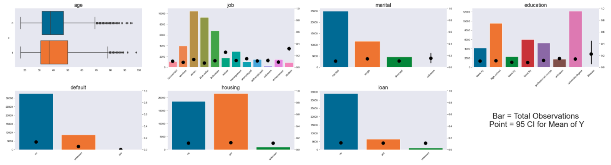

**Client Subcribed by Age** 
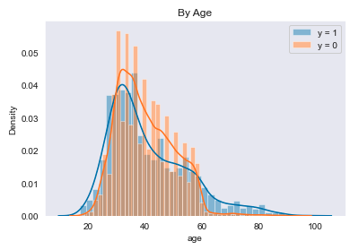

**Comparing Working and a Breakdown of Each Job** 
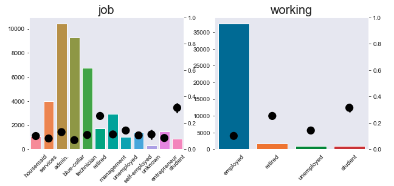

**Campaign Duration Data** 
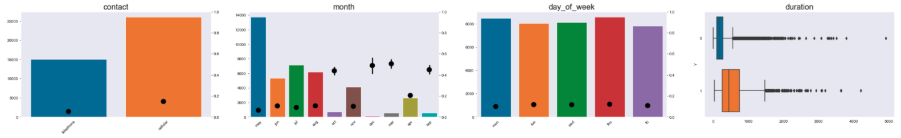

**Do cell phones lead to longer or shorter calls than home phones?** 
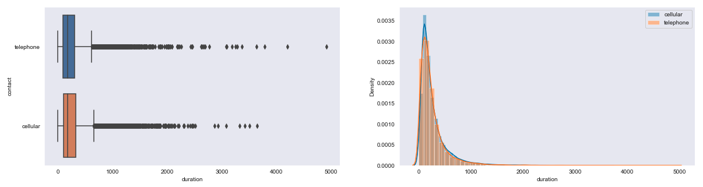

**Correlation between all Socio Eco Data** 
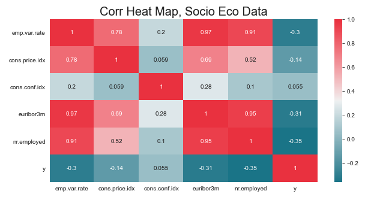

**Other Data** 
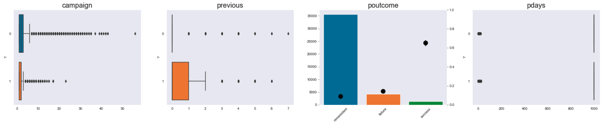 

>Previous Outcome is a good predictor, if they have previously converted they are likely to convert again.

**Campaign** 
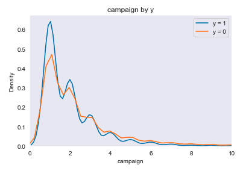 

>Number of times client has been contacted for this campaign. People usually convert within the first couple of calls.

**Previous Calls** 

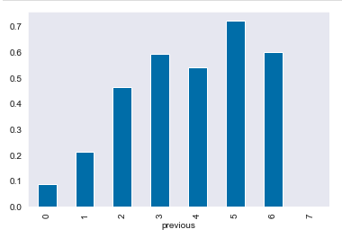 
>First time call recipients are less likely to convert for this campaign.

**Mean of Y by Month and Day** 
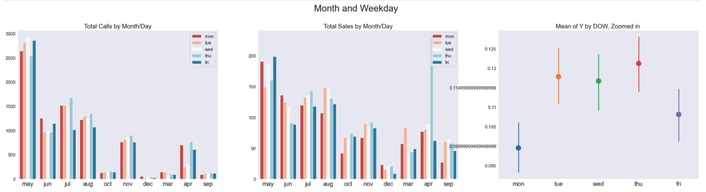

**Histogram for all Numeric Variables** 
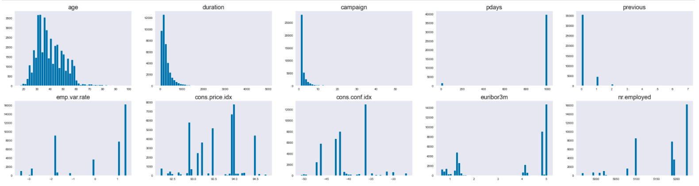

**Mean Across all groups of Categorical Variables** 
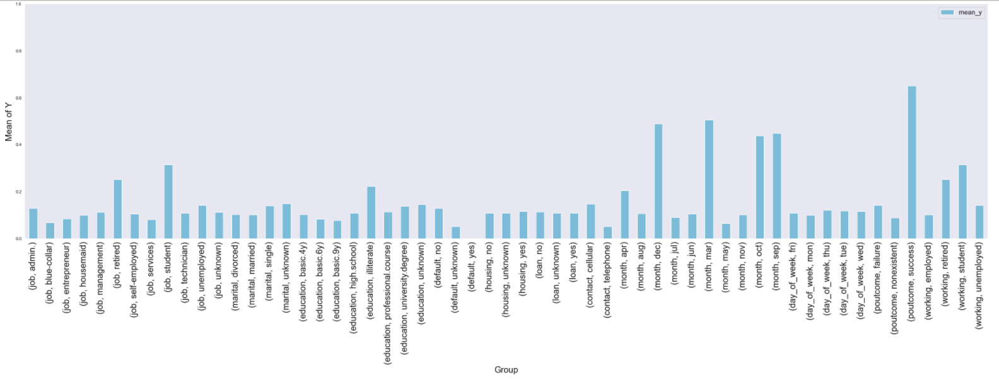

**Correlation between all Kept Columns** 
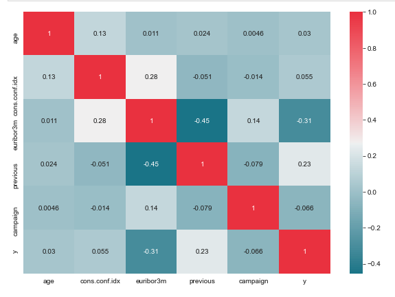

**Final KNN Avg Precision** 
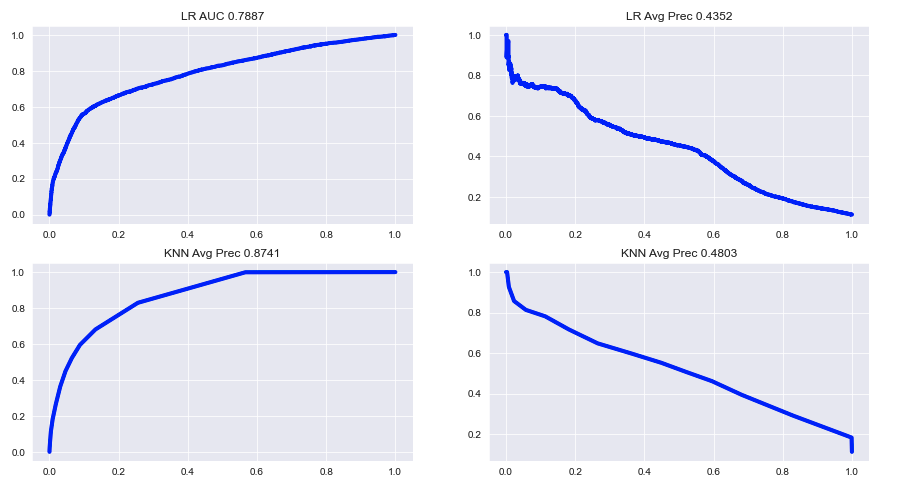

